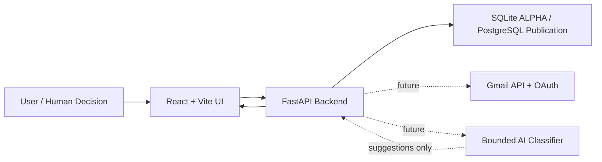

# SANE

SANE is a human-governed inbound email decision system.

It is being developed as a real-world RBA-guided application that helps users identify low-value email sources, make explicit decisions, and reduce ongoing inbox noise without replacing their email client.

SANE stands for **Signal Analysis & Notification Elimination**.

## Problem

Modern email systems generate large volumes of low-value, subscription-based messages. Email clients often categorize these messages into folders such as Promotions or Updates, but categorization can hide accumulation instead of resolving it.

The core problem is not only unwanted email. The deeper problem is the absence of a practical decision loop for identifying low-value inbound messages, acting on them, and marking the decision complete.

## Goal

SANE helps users process inbound email as a decision stream:

```text
Identify -> Decide -> Act -> Complete
```

Stage 1 focuses on proving this core loop with a bounded, human-in-the-loop workflow.

AI may classify, suggest, and explain candidates. The human remains responsible for approving meaningful actions.

## Current Status

This repository currently contains a bounded Stage 1 ALPHA candidate:

- React + Vite + TypeScript review UI
- Python + FastAPI workflow API
- SQLite-backed candidate and decision persistence
- deterministic backend classifier for demo candidates
- Pydantic-based backend settings
- frontend and backend workflow tests

Gmail OAuth, Gmail API integration, AI classification, and email actions are intentionally deferred.

## Architecture

Current and planned architecture:



The frontend is the user decision surface for reviewing candidates and recording explicit decisions.

The backend is the classification, workflow, and persistence layer for the ALPHA slice.

The current classifier is deterministic and local. A future AI-backed classifier can replace it without becoming the final authority.

## Structure

```text
SANE/
  docs/
  frontend/
  backend/
  README.md
```

## Tech Stack

- Frontend: React, Vite, TypeScript
- Backend: Python, FastAPI
- Data: SQLAlchemy 2.x, Pydantic, SQLite for ALPHA
- Publication database target: PostgreSQL
- Testing: Vitest and pytest
- Future integrations: Gmail API, Google OAuth, bounded AI classifier

## Frontend

```bash
cd frontend
npm install
npm run dev
```

Run tests:

```bash
cd frontend
npm run test:run
```

The frontend starts on `http://localhost:5173` by default.

## Backend

Copy the example environment file, install dependencies, and start the API:

```bash
cd backend
python -m venv .venv
# activate the virtual environment for your shell
pip install -r requirements.txt
copy .env.example .env
uvicorn app.main:app --reload
```

The default SQLite path is resolved from the backend directory, so copying `.env.example` is safe without setting a database URL immediately.

Run backend tests:

```bash
cd backend
pytest
```

The backend exposes a health endpoint at `http://localhost:8000/api/health`.

Current workflow endpoints:

- `GET /api/candidates`
- `POST /api/decisions`
- `GET /api/decisions`

## Current Scope

- Stage 1 review workflow for demo candidates: review, decide, and preserve processed state
- Backend candidate listing and decision recording endpoints
- Local SQLite persistence for candidates and decisions
- Deterministic classifier suggestions that remain subordinate to explicit human approval
- Frontend loading, error, and processed-history states
- No live email data or external email actions are executed yet

## Deferred Work

- Gmail OAuth and Gmail API integration
- Candidate ingestion and normalization
- AI classification module
- Human-approved action execution
- Alembic migrations and production deployment concerns
- Subscription tiers, billing, GTD workflow, and multi-account support
