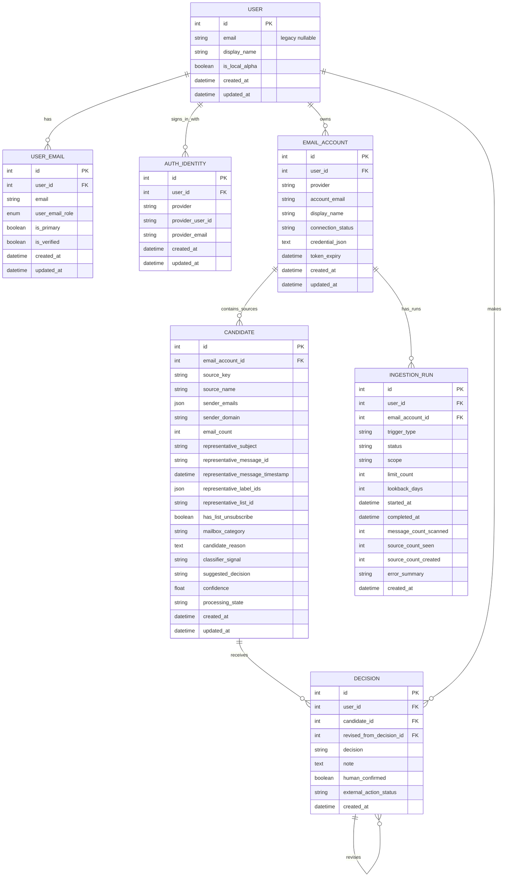

# SANE Data Model ERD

## Purpose

This artifact records the SANE account/auth/mailbox/source data model after the A40/A41/A42 planning pass, Prompt 07e foundation implementation, Prompt 08 auth/Gmail implementation, Prompt 10 ingestion quality updates, Prompt 13 bounded source evidence updates, and Prompt 13c UserEmail role governance.

It exists as a CORE/SKY review aid and as a future BASE reference.

Implementation status:

- Prompt 07e added the account/auth/mailbox/ingestion foundation.
- Prompt 08 added Google app authentication, separate Gmail authorization, encrypted Gmail credential storage, and manual bounded Gmail ingestion.
- Prompt 09 completed first live reality contact: Google sign-in, separate Gmail readonly consent, and one explicit 50-message `CATEGORY_PROMOTIONS` scan that created 32 live source rows.
- Prompt 10 added repeat-scan reporting with `source_count_seen`.
- Prompt 13 added bounded representative source evidence for safer future sender/action reasoning.
- Prompt 13c made `UserEmail.role` enum-backed using the existing non-native SQLAlchemy enum pattern and added migration-time validation for unexpected legacy role values.
- Current Alembic head after Prompt 13c is `0009_user_email_role_enum`.
- Latest reported validation after Prompt 13c included focused backend auth tests passing before full backend validation/runtime migration.

The key modeling lesson is:

```text
Do not implement deferred integrations prematurely,
but do model known future ownership boundaries.
```

## Intended Ownership Hierarchy

```text
User
-> UserEmail
-> AuthIdentity
-> EmailAccount
    -> Source/Candidate
    -> IngestionRun
        -> optional future message evidence
    -> Decision
```

## Mermaid ERD



## Table Meaning

### User

The stable SANE account owner.

Do not treat an email address as the user identity.

Prompt 08 made any remaining `User.email` value legacy/nullable. `UserEmail` is authoritative for email ownership and account linking.

### UserEmail

Email addresses associated with the user.

Used for primary/contact/login/notification identity and verification state.

`UserEmail.role` is now governed by the `UserEmailRole` enum:

- `primary`
- `login`
- `contact`
- `recovery`
- `billing`
- `notification`

Unexpected legacy role values now block the migration rather than being silently coerced.

### AuthIdentity

Ways the user can sign into SANE.

Examples:

- Google
- Microsoft
- GitHub
- LinkedIn
- Facebook
- local dev
- email/password
- magic link

Auth identity does not imply mailbox access.

### EmailAccount

Mailbox/account SANE is authorized to scan or represent.

Examples:

- Gmail
- Microsoft/Outlook
- IMAP
- Local ALPHA mailbox

Mailbox access does not imply app sign-in method.

Prompt 08 stores Gmail OAuth credentials as an encrypted credential blob on the email account for ALPHA. Tokens must never be exposed through frontend APIs.

### Candidate / Source

The current model name is `Candidate`, but the product concept is source/vendor/sender cluster.

Prompt 13c re-audited the A26 rename and kept it deferred because the blast radius is large across backend model names, migrations, tests, and project docs.

Sources belong to an `EmailAccount`, not directly to the `User`.

This supports one user with multiple mailboxes that contain the same source.

Current ALPHA source identity remains sender-email keyed:

```text
unique(email_account_id, source_key)
```

Prompt 13 added bounded source evidence fields:

- `sender_domain`
- `representative_message_id`
- `representative_message_timestamp`
- `representative_label_ids`
- `representative_list_id`
- `has_list_unsubscribe`

These fields are representative source evidence, not a full message archive.

Important sender-domain semantics:

```text
sender_domain: one domain for the source
sender_emails: one or more stored sender addresses for the source
```

SANE does not currently implement arbitrary cross-domain grouping.

### Decision

Human decision about a source.

`Decision.user_id` is intentionally retained for direct user decision queries and authorization checks.

This is controlled denormalization.

Invariant:

```text
Decision.user_id must match Decision -> Candidate -> EmailAccount.user_id
```

### IngestionRun

An explicit scan/import/analyze operation for one email account.

Gmail ingestion must never run simply because the app opens.

Allowed future triggers:

- manual user-requested scan
- scheduled/chrono-controlled scan
- bounded ALPHA/test scan

Current ALPHA behavior:

- manual user-requested scan only
- default scan scope `CATEGORY_PROMOTIONS`
- bounded scan limits 50 / 100 / 200
- repeat scans report both new sources and sources seen/refreshed
- no scan on app open
- no scan on sign-in
- no scan on Connections view render

## Key Constraints

Expected constraints:

```text
UserEmail.email should be unique or carefully governed for account-linking policy.
AuthIdentity should be unique by provider + provider_subject.
EmailAccount should likely be unique by user_id + provider + account_email.
Candidate/Source should be unique by email_account_id + source_key.
```

Implemented source identity rule:

```text
unique(email_account_id, source_key)
```

This supersedes both the original global `source_key` uniqueness and the interim user-scoped rule.

Implemented email authority rule:

```text
UserEmail is authoritative for email addresses and verified-email linking.
User.email is legacy/nullable only if still present for compatibility.
```

## Disconnect vs Delete

Disconnect means:

- mailbox is not connected
- scans/imports/actions are blocked
- local SANE data is preserved
- stored Gmail credentials are cleared for Prompt 08 ALPHA behavior

Delete means:

- mailbox is disassociated from SANE
- related local mailbox data is removed
- cascade behavior must be intentional and tested

## Data Minimization

Early Gmail ingestion should not store full email bodies.

Prefer minimal metadata needed for:

- source classification
- representative examples
- dedupe/reference
- human decision support

Prompt 13 keeps stored evidence bounded:

- no full bodies
- no attachments
- no thread content
- no recipients
- no raw Gmail payload JSON
- no raw unsubscribe URLs or mailto values
- no representative snippets in this pass

The stored Gmail-derived evidence remains source-level and representative.

## Future Notes

Potential future additions:

- MessageEvidence / SourceEvidence
- token/credential reference model
- account merge policy
- subscription/account tier model
- scheduled ingestion jobs
- sender/source merge and split tools
- source-only reset that preserves decision history, if the current Candidate -> Decision cascade is redesigned
